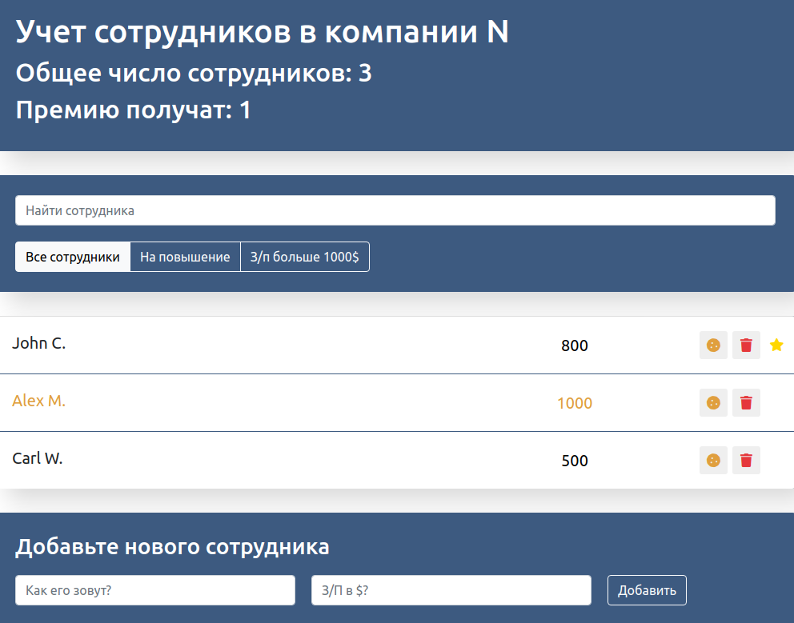
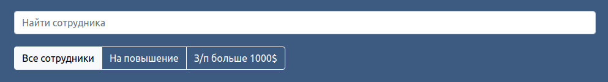


This is another study project that is similar to classic To-do-list.

In this application we can manage employees list. We can set their salaries, change promotion status by clicking to the name of employee (add a star symbol), give them bonus by clicking to the cookie symbol, add / remove employees, edit their names and salaries. Also we can use filters on this list to find employee by it's name, find employees with promotion or salary rate more than $ 1000. The summary information about employees is shown in the header of applicatin interface, and refreshes when list is employees changing.

This is another study project that is similar to classic To-do-list. In this application we can manage employees list. We can set their salaries, change promotion status by clicking to the name of employee (add a star symbol), give them bonus by clicking to the cookie symbol, add / remove employees, edit their names and salaries. Also we can use filters on this list to find employee by it's name, find employees with promotion or salary rate more than $ 1000.

 The summary information about employees is shown in the header of applicatin interface, and refreshes when list is employees changing.

